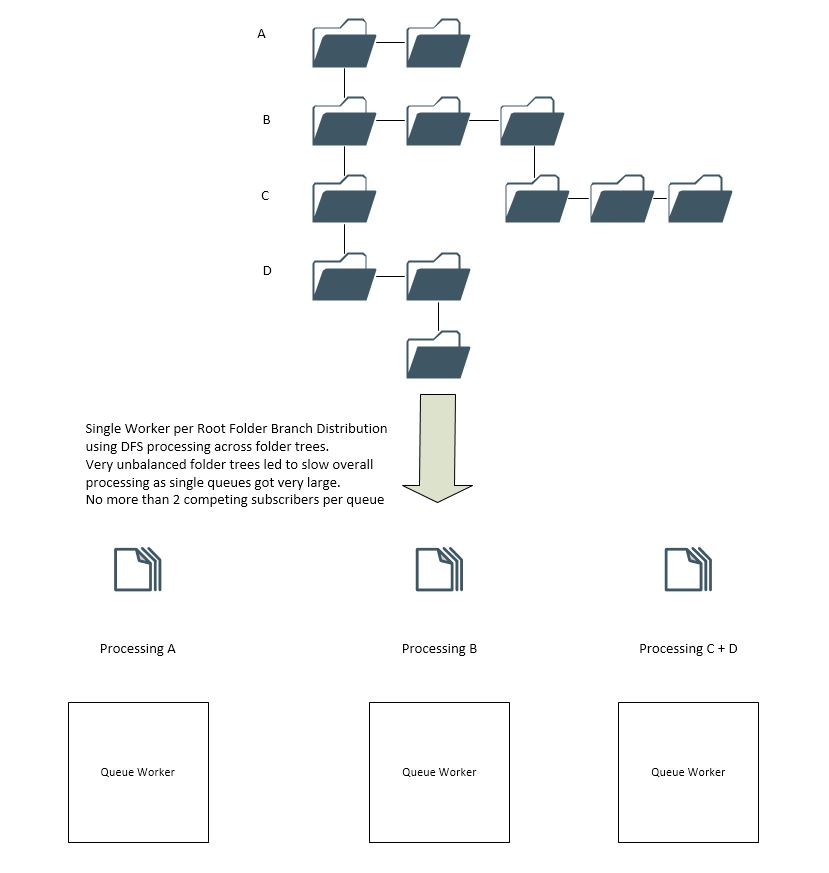
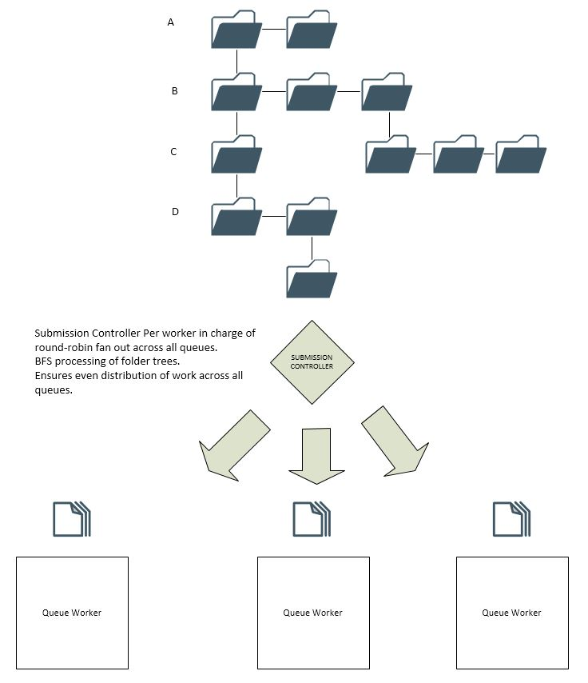

# File Copier Design

The premise of the file copier was that our partner's customers had enough theoretical bandwidth in their data centers to copy their data to Azure storage overnight or at the weekends.  
However, due to the size and structure of the data on disk, this was not possible.  
AzCopy was not able to copy 40GB within 7 days, and they only had a maximum downtime of 2 days available, overnight being preferable to allow more flexible project schedules.
In addition, standard tooling available on Linux or in AzCopy did not recover well after a failure.

Once data had been copied to Azure, we hit the next issue with the disaster recovery tooling, and content taking days to be recovered.

## Basic Concept

At the time of starting on the project, I had drifted off into the zone of "generalist programmer", familiar with many different languages and frameworks, but master of none.
My job just didn't give me time to specialize any more, so I went for C#, with which I had the longest history regarding performance optimization and was most familiar with at the time. I also really wanted to use [.Net Core](https://dotnet.microsoft.com/download/dotnet-core
) on a project which had some teeth in it. :-)

I was also very familiar with distributed computing, message passing and integration patterns, so my mind immediately went to fault tollerant message queues as a method of keeping track of work items.

The data structure of the folder tree presented 2 options to traverse it, familiar I hope to most computer science students, with our goal of "finding" all files / leaf nodes and copying them to the target system:  
BFS - [Breadth first (search)](https://en.wikipedia.org/wiki/Breadth-first_search)  
DFS - [Depth First (search)](https://en.wikipedia.org/wiki/Depth-first_search)

This either required a queue or a stack, which could be provided by [Azure Redis Cache](https://azure.microsoft.com/services/redis_cache)

## Optimizations

We quickly proved the theory worked, and started working on improving the initial concept and increasing throughput.

As with any system, there were a number of bottlenecks which we could be sure to hit, and as we looked at parallelization of the work items, we needed to decide on how to orchestrate these reliably.

1. CPU usage on host system.
2. Storage Performance (IOPS) on host system.
3. Storage Performance (IOPS / bandwidth) on target system.
4. Network bandwidth on host system.
5. Memory on host system.
6. Performance of message service (queues)
7. Performance of Stack / redis service

Azure Storage can suffer from contention of the subscribers to the Azure Storage Queue when there are a high number of subscribers (workers), this is resolved and can be tuned by modifying the batched work item retrieval from the queues to reduce the number of calls each subscriber (queue client) makes to the work queue.

## The Submission Controller
 
Due to the way in which the folder trees were structured, some workers ended up having 100s of 1000s more work items to process than the other workers.

This led to the creation of the submission controller, which sits between the workers and the work item queues.

It's job is to evenly distribute all work between the queues, meaning all workers get close to exactly the same amount of work.

## Storage Types

### Azure Files
Azure Files started as the choice for our naieve implementation, as it required no changes to the solution which was being rehosted in Azure, and allowed us to simulate mount points and NFS access fairly easily.  
The Azure Files SDK requires a reference to a parent folder in order to access the subfolders, all the way up to the root of the path. This means that BFS processing of trees was advantageous, as it ensured that each level of folders were created and present before moving on to the next level, and we could be "fairly" certain that parent folders were present (optimizing the failure logic for this case).  
However, if we split work between queues, we lost this advantage and had to always ensure that folders are present, with little guarantee that they will be there.

### Azure Blob
While Azure files behaves similarly to a hierarchichal file system in Azure, Azure Blob storage is flat.  
Folder paths are represented by the prefix to the blob name, and as such are only a string representation, rather than a cloud data structure requiring a reference like Azure files.  
This significantly simplified the processing for Blob Storage targets.